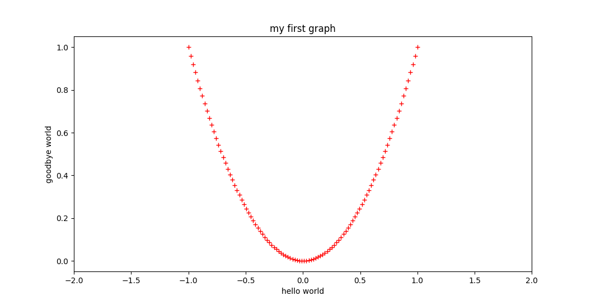
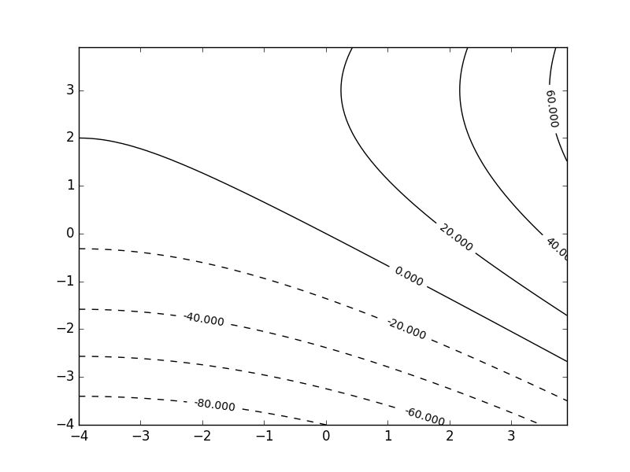

---
title: Introduction to Python
author: Ben Bettisworth
inline_code_attributes: yes
...

# Some Basic Types

Basic builtin types in python:

- `int`{.python}
    - `42`{.python}
- `float`{.python}
    - `3.14`{.python}
    - `1.0`{.python}
- `str`{.python}
    - `'hello world'`{.python}
    - `"goodbye world"`{.python}
- `complex`{.python}
    - `1+1j`{.python}
    - `.5+0j`{.python}
- `bool`{.python}
    - `True`{.python}
    - `False`{.python}
- `None`{.python}

# More Basic Types

- `list`{.python}
    - `[1,2,3,4]`{.python}
    - `[1.2, "none", None]`{.python}
- `tuple`{.python}
    - `(True, 1)`{.python}
    - `(None, 3.14, 'asdf')`{.python}
- `dictionary`{.python}
    - `{'a': 1, 2: 'buzz'}`{.python}
- `bytes`{.python}
    - `b"left and right"`{.python}
    - `b"\xDE\xAD\xBE\xEF"`{.python}

# Operations (Arithmetic)

- Binary:
    - `+`, `-`, `*`, `/`, `//`, `%`, `**`
    - `^`, `&`, `|`, `<<`, `>>`
    - `@`
- Unary:
    - `~`
    - `not`{.python}

# Operations (Comparison)

- `==`, `!=`, `<`, `<=`, `>=`, `>`
- `is`{.python}, `is not`{.python}
- `or`{.python}, `and`{.python}

# Flow control

```{.python}
if i == 0:
    print("i is zero")
```

```{.python}
for i in range(10):
    if i % 3 == 0:
        print("buzz")
```

```{.python}
while i != 0:
    i //= 2
```

# Functions

```{.python}
def foo(a, b):
    return a + b + 1

def bar(a, b=3.14):
    return a ** 2 * b

foo(1,1)
bar(2)
```

# Fizbuzz

Write a function that:

- takes a number
- prints the numbers
- if the number is divisible by 3, print "fizz"
- if the number is divisible by 5, print "buzz"


# The python workflow

Up until now, the work flow has been fairly painful. We can do better. Instead
of writing code in python directly, we can write code in a file, and run the
file:

Contents of `fizzbuzz.py`:

```python
#!/usr/bin/env python3

def fizzbuzz(iters):
    for i in range(iters):
        print(i, ": ", end='')
        if i % 3 == 0:
            print("fizz", end='')
        if i % 5 == 0:
            print("buzz", end='')
        print('')

fizzbuzz(20)

```

# Installing an IDE

There are several IDE's avaliable for python.

- Pycharm
- VScode
- Sublime
- Atom
- Spyder
- Jupyter

Of these, its seems that the easiest is Pycharm.

# Running a program

Once we have a program, we need to run it. How to do this depends on the IDE
that you picked. If you want to run the program in the terminal, we can write:

```
python3 fizzbuzz.py
```

In Pycharm, there is a green arrow in the toolbar to run the code in a console.

# Comments

Much like in bash `#`{.python} is the single line comment character. Example:

```{.python}
# call foo, in preparation of buzz()
foo()
buzz() # here we call buzz
```

A mulitline comment is surrounded by `'''`{.python} or `"""`{.python} Example:

```{.python}
def foo(a, w)
    """ foos is a function that fooifys the widgets 

    a: much to fooify
    w: the widget
    """
    return a * w

```

# Taking input

We can take input from the user by using `input`:

```.python
response = input("What is the best food in the world?")
if response is not "potatos":
    print("WRONG")
```

-------------------------------------------------------------------------------

# Simple REPL, guessing game

Write a program that plays a guessing game:

- User should pick a number between 0 and 100
- Program should guess the number
- Program should ask questions to find the number

-------------------------------------------------------------------------------

# Simple REPL, guessing game (Solution)

-------------------------------------------------------------------------------

# Implement a formula

Implement a function that computes a function. It can be any function, but here
is a suggestion

$$
f(x,y) = (a - x)^2 - b(y - x^2)^2
$$

-------------------------------------------------------------------------------

# Function arguments are by refrence

```{.python}
def append_one(l):
    l.append(1)

append_one(l)
print(l)
```

Result:

```python
[1, 2, 1]
```

# Everything in python is a reference

```{.python}
l = [1, 2, 3]
b = l
b.append(1)
l
```

Result:

```
[1, 2, 3, 1]
```
# Everything in python is a reference

```{.python}
l = [1, 2, 3]
b = l
l.append(1)
l
```

Result:

```
[1, 2, 3, 1]
```

# Recursion

```{.python}
def fibo(n):
    if n == 0 or n == 1:
        return 1
    else:
        return f(n-1) + f(n-2)
```

# Magic Functions and Operator Overloading

```{.python}
class foo:
    def __init__(self, a, b):
        # initialize object here

    def __add__(self, other):
        # Do adding here

    def __sub__(self, other):
        # Do subtracting here

    def __str__(self):
        # Return a string form of the object
```

-------------------------------------------------------------------------------

# MyComplexNumber

The classic way to introduce classes is to implement some reasonably complex
data structure. We  are going to do a complex number class together.

-------------------------------------------------------------------------------

# Docstrings

There is a special type of comment called a Docstring. These are actually
parsed by the interpreter and included in the object's data. They are placed
immediately after a function definition, or a class declaration.

```{.python}
class RealMatrix:
    """A matrix type, only supports reals.

    This type supports addition, elementwise 
    multiplication, and the matrix operator
    """
```

-------------------------------------------------------------------------------

# Exceptions

Consider the following code:

```{.python}
def baz(a, b):
    return (a+b)/(a-b)
```

What could go wrong?

-------------------------------------------------------------------------------

# Exceptions (cont)

`a`could equal `b`! This would cause the interpreter to attempt to divide by
zero.

```{.python}
>>> baz(1,1)
Traceback (most recent call last):
  File "<stdin>", line 1, in <module>
  File "<stdin>", line 2, in baz
ZeroDivisionError: division by zero
```

-------------------------------------------------------------------------------

# Exceptions (cont)

Suppose we didn't want this error to be fatal, I.E we have some reasonable
behavior for this case. We could use exceptions

```{.python}
def baz(a,b):
    try:
        return (a+b)/(a-b)
    except ZeroDivisionError:
        return float('inf')
```

-------------------------------------------------------------------------------

# Lambdas

A lambda or anonymous function is an expression like so:

```{.python}
lambda a,b: (a-b)**2/2
```

This function can then be given a name, and passed to functions:

```{.python}
l = lambda a,b: (a-b)**2/2
foo(l)
```

-------------------------------------------------------------------------------


# Floating Point Numbers

Floating point numbers are specified by IEEE 754. These numbers are meant to
approximate the real number line, but fail in several important ways.

```{.python}
>>> 0.1  + 0.1 + 0.1 == 0.3
False
```

-------------------------------------------------------------------------------

# Floating Point Numbers (cont)

Another phenomenon to be aware of is "catastrophic cancellation". Consider:

$$ x = \frac{-b \pm \sqrt{b^2 - 4ac}}{2} $$

If

$$b^2 = 4ac + \epsilon $$

Then $\sqrt{b^2 - 4ac} = \sqrt{\epsilon}$. All the all the information
remaining in the number is error!

-------------------------------------------------------------------------------

# Numpy

Suppose that we the following setup for the remaining subsections

```{.python}
import numpy

A = numpy.array( [[1,2,3],
                  [5,3,6],
                  [1,3,4]] )
B = numpy.array( [[6,2,1],
                  [3,4,2],
                  [1,2,8]] )
x = numpy.array( [[1],
                  [2],
                  [4]] )
y = numpy.array( [[1],
                  [1],
                  [1]] )
```

-------------------------------------------------------------------------------

## Elementwise Addition

```{.python}
>>> x + y
array([[2],
       [3],
       [5]])
```


## Elementwise Multiplication

```{.python}
>>> x * y
array([[1],
       [2],
       [4]])
```


## Transpose

```{.python}
>>> x.T
array([[1, 2, 4]])
```

--------------------------------------------------------------------------------

## Inner Product

```{.python}
>>> x.T @ y
array([[7]])
```


## Outer Product

```{.python}
array([[1, 1, 1],
       [2, 2, 2],
       [4, 4, 4]])
```


## Scalar Addtion

```{.python}
>>> x + 1
array([[2],
       [3],
       [5]])
```

--------------------------------------------------------------------------------


## Scalar Multiply

```{.python}
>>> x * 2
array([[2],
       [4],
       [8]])
```


## Elementwise Addition

```{.python}
>>> A + B
array([[ 7,  4,  4],
       [ 8,  7,  8],
       [ 2,  5, 12]])
```


## Elementwise Multiplication

```{.python}
>>> A * B
array([[ 6,  4,  3],
       [15, 12, 12],
       [ 1,  6, 32]])
```

--------------------------------------------------------------------------------

## Scalar Addition

```{.python}
>>> A + 1
array([[2, 3, 4],
       [6, 4, 7],
       [2, 4, 5]])
```


## Scalar Multiply

```{.python}
>>> A * 2
array([[ 2,  4,  6],
       [10,  6, 12],
       [ 2,  6,  8]])
```


## MatVec operations

```{.python}
>>> A@x
array([[17],
       [35],
       [23]])
```

--------------------------------------------------------------------------------

## MatMat operations

```{.python}
>>> A@B
array([[15, 16, 29],
       [45, 34, 59],
       [19, 22, 39]])
```

-------------------------------------------------------------------------------

# A gotcha

```{.python}
>>> A + x.T@y
array([[13, 14, 15],
       [17, 15, 18],
       [13, 15, 16]])

>>> A + x@y.T
array([[13, 14, 15],
       [17, 15, 18],
       [13, 15, 16]])

>>> A + numpy.outer(x,y)
array([[ 3,  4,  5],
       [ 9,  7, 10],
       [ 7,  9, 10]])
```

-------------------------------------------------------------------------------

# Mapping/vectorizing

```{.python}
>>> uparrow = lambda a, n, b: 1 if b == 0 else ( 
        a**b if n == 1 else 
        uparrow(a, n-1, uparrow(a, n, b-1)))
>>> vector_arrow = numpy.vectorize(uparrow)
>>> vector_arrow(A, 2, 2)
array([[    1,     4,    27],
       [ 3125,    27, 46656],
       [    1,    27,   256]])
```

-------------------------------------------------------------------------------


# Factoring Matricies

```{.python}
>>> numpy.linalg.qr(A)
>>> numpy.linalg.svd(A)
>>> numpy.linalg.cholesky(A)
```

-------------------------------------------------------------------------------

# Least Squares regression

```{.python}
>>> numpy.linalg.lstsq(A,b)
```

-------------------------------------------------------------------------------

# Solving a system

```{.python}
>>> numpy.linalg.solve(A,x)
array([[ 4.],
       [12.],
       [-9.]])

```

-------------------------------------------------------------------------------

# Eigenvector Decomposition

```{.python}
>>> numpy.linalg.eig(A)
(array([ 9.31175886, -0.19177208, -1.11998678]), 
array([[-0.37059038, -0.23563535,  0.13673481],
       [-0.77711937, -0.76281637, -0.86611268],
       [-0.50867303,  0.60215212,  0.48078312]]))
```

-------------------------------------------------------------------------------

# Scipy

Scipy is a library built on top of numpy. It contains many useful utilities,
but is fairly specific. We will only cover optimization routines.

-------------------------------------------------------------------------------

# Minimize a function

```{.python}
>>> def polynomial(x):
...    return x**2 + 2 * x + 1
...
>>> scipy.optimize.minimize(polynomial, 2)
      fun: 8.881784197001252e-16
 hess_inv: array([[0.5]])
      jac: array([-4.47034836e-08])
  message: 'Optimization terminated successfully.'
     nfev: 9
      nit: 2
     njev: 3
   status: 0
  success: True
        x: array([-1.00000003])
```

-------------------------------------------------------------------------------

# Matplotlib

Matplotlib is one of the many plotting libraries in python. 
It has an interface that is intended to be the similar to matlab's plotting
functions. 

-------------------------------------------------------------------------------

# Basic plot



-------------------------------------------------------------------------------

# Contour Plot



# Other graphing options

- `ggplot2`
- `plot.ly`

# Some Software engineering notes

In general, it is a good idea to use some sort of version control software.
Advantages are:

- Backups
- Risk free changes
- Assists in distributing code
- Helps others collaborate with you

# Version control tools

There are several version control systems out there. Here they are ranked by
populatity:

1. Git
2. Subversion
3. Mercurial
4. CVS
5. Bazaar

Of these, I personally prefer Git and Mercurial, and have a strong dislike of
Subversion

# A quick introduction of Git

```
git init .
git add fizzbuzz.py
git commit -m "here is a commit message"
```

# A quick introduction of Mecurial

```
hg init .
hg add fizbuzz.py
hg commit -m "here is a commit message"
```

# Concepts common to Git and Mercurial

Both track changes in a **repository**, which is a collection of files. A
repository is often a directory. 
They track the _changes_ to the files within the repository, and record those
changes. These changes are called **revisions**.

A programmer interacts with these systems by bundling one or more changes to
files into a **commit**, which is entered into the source control system.

# Concepts common to Git and Mercurial (cont)

Since a **commit** is a collection of _changes_, the commit needs to keep track
of what the changes are _from_. Therefore, each commit keeps track of its
**parent**, by referencing the previous commit.

Keeping this in mind, we can now look at a repository of code as a _directed
acyclic graph_ (DAG) of changes, starting from now, and going _backwards_ in time.

# Branches

Because we have represented the source code as a DAG, we can now allow for
multiple paths from now to the past. We can have multiple _versions_ of the same
repository, within a single repository.

We refer to these different versions of the repository as **branches**. These
allow us to experiment with code, safely trying new things without deleting the
old, working versions.

# Merging

Suppose we have made a **branch**, and the code in it is working. We might want
to add that code to the main version of the repository. For this we could
perform a **merge**, where we attempt to apply the changes in one **branch** to
another branch.

In the cases when each file has been modified in separate places, then
**merging** can be done automatically.

# Remotes

**Remotes** are repositories on other computers. The primary use for a
**remote** is to share code. Two examples of a popular remote are Github/Gitlab.
To list the remotes in git, we can write

```
git remote -v
```

# Interacting with remotes

When we interact with remotes, we treat them as **branches**. So, when we send
or receive commits from a **remote**, we are actually merging **branches**.

# Differences between Mercurial and Git

In general, Mercurial and git are extremely similar. The primary difference is
philosophical.

- Mercurial is a system
- Git is a data structure

These philosophical differences translate to practical differences. The big one
is that commits in Mercurial are tagged with the branch that they are a part of.

These differences don't make a huge difference, use the one you like the best.

# General advice for Git

If you find that something didn't "just work", I really suggest you thing
about the fact that git is a _data structure_, and commands are operations on
that structure.
 
 Because of this, there is probably a command for anything that you would want
 to do on git already. Stack overflow is your friend, but it is good to learn
 general tools such as `git rebase` and `git cherry-pick`.

# Git Flow

A common work pattern for writing code in a git repository is:

1. `git checkout -b` _feature branch name_
2. work for a while
3. `git add` _channged files_
4. `git commit -m ` _message_
5. `git checkout master`
6. `git merge` _feature branch name_

Optionally, we can "squash" the commits in the branch to be nice and neat with
`git rebase -i` between steps 4 and 5.
